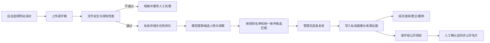

# 成员私有画像与逐字稿自动完善 Roadmap

## 1. 当前版本边界

本期只建设“历史资料整理 → 私有成员画像 → 后台人工查看与账号关联”能力：

- 来源是已有的活动 AI 总结与配套逐字稿。
- 只提取有可识别姓名或稳定称呼的成员线索；未具名 Speaker 不自动创建可关联画像。
- 网站活动只按 `Asia/Shanghai` 的活动日期匹配。AI 自动总结标题仅作为来源标题，不作为匹配条件。
- 同名、别名、组织信息冲突均保持“待复核”，不得因为文本相似就自动关联小程序账号。
- 历史资料中明确为未成年人的参与者默认不导入画像，除非后续完成监护人同意与专门保护流程。
- 画像表和证据表只允许具备 `members.read_private_profile`（L3）权限的后台人员读取，前台与小程序没有读取策略或接口。
- 即使后台记录“已取得展示授权”，当前版本也不会把私有画像同步到公开成员名片。
- 本期没有逐字稿上传入口、对象存储、任务队列或第三方模型 API。

当前导入命令：

```bash
npm run members:profiles:import -- \
  --source '<历史活动资料目录>' \
  --aliases output/member-private-profiles/aliases.json \
  --dry-run
```

确认数据库迁移已经完成后，将 `--dry-run` 改为 `--apply` 才会写入私有表。别名映射属于私有人工判断，保存在忽略 Git 的 `output/`，不进入公开仓库。

## 2. 数据与权限原则

### 2.1 数据分层

| 层级 | 内容 | 默认可见范围 |
| --- | --- | --- |
| 账号事实 | 小程序/网站账号、统一成员 ID、报名与签到记录 | 用户本人 + 对应后台权限 |
| 私有画像 | 背景、行业、能力、兴趣、需求、可合作方向 | L3 成员画像权限 |
| 来源证据 | 活动日期、总结/逐字稿文件名、原始观察、置信度 | L3 成员画像权限 |
| 公开名片 | 用户主动填写或逐字段明确授权公开的内容 | 按现有公开规则 |

私有画像不能反向覆盖用户主动填写的公开名片。未来如果允许“采用画像建议”，也必须由用户或管理员逐字段确认，保留来源与操作审计。

### 2.2 合规底线

以下内容是产品与技术边界，不替代正式法律意见：

- 内部画像本身也是个人信息处理，不应把“没有公开”理解为“不需要告知或合法处理基础”。上线自动化前，应由运营与法律顾问确认历史资料的处理依据，并向成员提供清晰的查阅、更正、删除和撤回渠道。
- 个人信息处理规则应明确处理者、目的、方式、种类、保存期限、到期处理方式，以及成员行使查阅、更正、删除、撤回等权利的入口。网络数据处理规则还要求这些内容清晰、易于访问，并在目的或方式变化时重新取得同意。
- 如果材料涉及未成年人、医疗健康、金融账户、行踪轨迹等敏感个人信息，必须进入更严格的单独同意与人工审查流程；默认不交给第三方模型处理。
- 第三方模型属于受托处理或数据接收方时，要通过合同限定目的、方式、范围、保存期限与安全义务，并核验服务商是否会保留输入、用于训练、转交其他处理者或发生跨境传输。
- 模型输出只能作为候选观察，必须提升准确性与可追溯性，不能直接形成成员标签、合作优先级或对成员产生显著影响的自动化决定。

官方依据：

- [《中华人民共和国个人信息保护法》](https://www.npc.gov.cn/npc/c2/c30834/202108/t20210820_313088.html)
- [《网络数据安全管理条例》](https://xzfg.moj.gov.cn/front/law/detail?LawID=1734)
- [《生成式人工智能服务管理暂行办法》](https://www.cac.gov.cn/2023-07/13/c_1690898327029107.htm)

## 3. 后续状态机



任何模型失败、身份匹配不确定、同名冲突、来源矛盾或授权不足，都应停在人工复核之前，不能自动写入正式画像。

## 4. 分阶段路线图

### M1：治理与授权准备

目标：先明确“可以处理什么”，再建设上传能力。

- 更新活动报名隐私告知，明确活动可能录音、转写、用于内部成员服务与画像完善的具体目的、字段范围和保存期限。
- 把活动参与同意、录音告知、内部画像处理、肖像公开授权拆开，不使用一个总开关捆绑。
- 为历史资料制定补充告知和成员反馈机制；无法确认处理依据的材料只保留在受限档案，不进入自动处理。
- 建立成员查阅、更正、删除、限制处理、撤回授权的后台 SOP 与响应时限。
- 定义保留期限：原始音频、逐字稿、结构化证据、模型中间结果分别设置期限，不无限期保存。
- 完成第三方模型供应商评估表和数据处理协议模板。

验收条件：隐私文本、数据字段清单、处理记录、删除流程和供应商准入标准均经过人工审核。

### M2：逐字稿安全上传（不接模型）

目标：先跑通可审计的资料入口。

- 后台活动详情增加“逐字稿资料”区域，上传时必须选择网站活动，不允许模型根据标题猜活动。
- 支持 `.txt`、`.md`、经过安全解析的 `.docx`；首版不收原始音频和 PDF 扫描件。
- 文件进入私有对象存储，使用短时签名 URL；禁止公共 bucket。
- 保存文件哈希、上传者、活动 ID、录音/转写授权状态、版本、处理状态和审计日志。
- 做大小限制、MIME 与扩展名双重校验、恶意文件检测、重复文件识别。
- 提供“下载原文件、替换版本、撤回处理、到期删除”，但不允许普通后台角色批量导出。

验收条件：上传、下载、替换、删除和权限绕过测试通过，文件不会出现在公开 CDN 或页面源代码中。

### M3：模型网关与异步任务

目标：引入模型时不把供应商逻辑写进页面请求。

- 服务端增加统一模型网关，前端不持有 API Key。
- 通过异步任务队列处理长逐字稿，支持分片、重试、幂等、超时、取消和成本上限。
- 供应商配置必须记录数据保留、是否用于训练、区域、子处理者、跨境情况；默认选择不训练、最短保留的企业 API。
- 上传前做字段级最小化和可选脱敏；模型只接收完成任务必需的片段。
- 输出固定 JSON Schema：候选人物、观察类型、原文定位、置信度、冲突提示。拒绝自由文本直接落库。
- 日志只记任务 ID、耗时、token、状态和标准化错误，不记录逐字稿正文、姓名、联系方式或模型完整响应。

验收条件：模型不可用时后台仍可安全工作；重复任务不产生重复画像；成本与错误可观测但不泄露内容。

### M4：身份解析与人工复核台

目标：把“这个人是谁”与“这个人说了什么”分开处理。

- 优先使用活动报名/签到名单生成候选账号，再结合姓名、别名、组织和历史参与日期评分。
- 只输出候选，不自动合并；同名、昵称、ASR 错别字和组织变更必须人工确认。
- 支持“关联现有账号、创建未关联画像、标记不是成员、拆分误合并、合并重复画像”。
- 每条观察显示活动日期、原文定位、模型版本、置信度和复核人。
- 冲突字段并存，不用新一次模型输出静默覆盖旧事实。

验收条件：对一组含同名、别名和匿名 Speaker 的回放数据测试，错误关联率为 0；不确定项全部停留在待确认。

### M5：成员自助与受控公开

目标：让画像变成成员可控制的社区资产。

- 小程序增加“社区掌握的我的资料”入口，成员可查看、纠正、删除或限制处理。
- 将后台画像转成“资料完善建议”，由成员逐字段采用或拒绝。
- 公开授权按字段和用途记录，例如“技能标签可在成员名片展示”“合作需求仅供管理员匹配”。
- 授权撤回后立即停止新的公开使用，并触发缓存清理与下游同步任务。
- 禁止公开原始逐字稿、内部评价、置信度、未确认身份、联系方式和敏感个人信息。

验收条件：成员能完成查阅、更正、删除、撤回；公开页面只展示有明确字段级授权且经过确认的数据。

## 5. 建议指标

- 身份候选准确率、人工确认率、误关联数。
- 每场活动新增/更新画像数，按“已复核”和“未闭环”分开。
- 模型观察被接受、修改、拒绝的比例。
- 成员查阅、更正、删除、撤回请求的完成时长。
- 逐字稿任务成功率、平均耗时、单场成本，不记录正文内容。
- 私有表越权访问测试通过率、审计日志覆盖率、到期删除完成率。

不建议把“画像字段越多”作为核心指标。更重要的是可核验、可更正、可授权、能促成真实连接，同时不过度收集。
