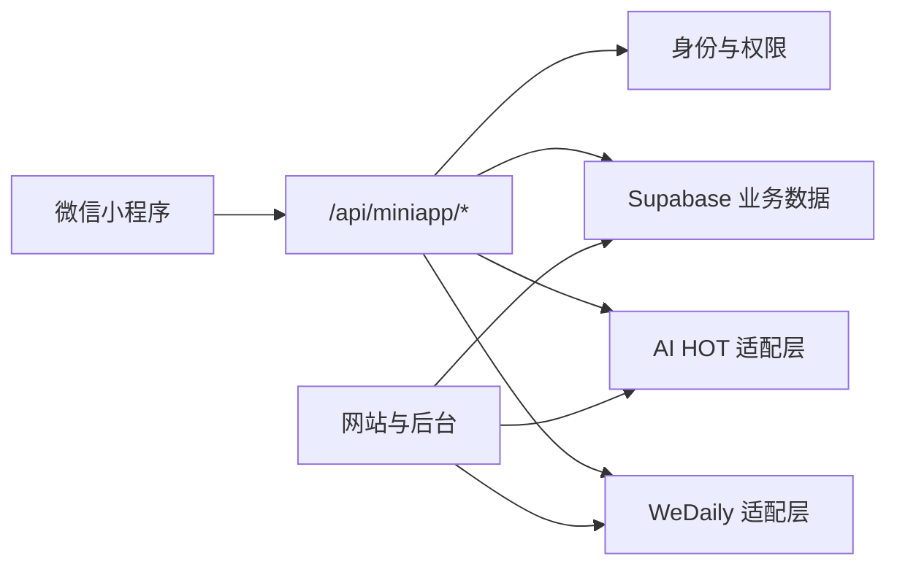

# 常州 AI Club 小程序 Roadmap

> 状态：M1 开发中｜更新日期：2026-07-17｜当前版本：`0.1.4`

## 1. 产品定位

小程序将逐步成为微信群成员的主要交互阵地，承担四类高频任务：

1. 完善成员资料，形成可检索、可维护的社区能力池。
2. 浏览 AI 资讯、群聊精华和社区动态，建立持续打开理由。
3. 报名活动、查看参与记录、接收活动提醒。
4. 发布或响应真实需求，由社区完成成员、能力和项目的连接。

各产品载体保持明确分工：

| 载体     | 主要职责                                           |
| -------- | -------------------------------------------------- |
| 小程序   | 成员身份、日常内容、活动操作、能力发现、需求响应   |
| 微信群   | 即时讨论、关系建立、现场协作                       |
| 官网     | 品牌展示、公开内容、搜索引擎收录、长文与公开分享页 |
| 网站后台 | 内容审核、成员管理、项目管理、需求撮合和运营分析   |

不在早期建设第二套群聊或论坛。推荐的社区闭环是：

```text
微信群讨论 -> 群聊精华 -> 小程序沉淀 -> 成员表达能力或需求
-> 管理员筛选撮合 -> 活动/项目协作 -> 案例与社区动态
```

## 2. 产品原则

- **资料转化优先**：注册不是终点，能用于匹配的结构化资料才是有效激活。
- **内容带动留存**：AI 资讯和群聊精华提供每天或每周打开小程序的理由。
- **先人工撮合，再逐步智能化**：早期由管理员确认需求和候选人，避免低质量自动推荐。
- **公开范围由成员决定**：资料可用于社区内部匹配，不等于默认公开联系方式。
- **小程序只调用主站 API**：不直连 Supabase 或外部内容源，由 `/api/miniapp/*` 统一鉴权、裁剪和缓存。
- **一次建设，多端复用**：成员、活动、项目、案例和内容继续共用主站的数据模型。
- **保持信息清晰**：AI 能力优先用于摘要、检索和推荐，不用夸张的视觉风格替代实际价值。

## 3. 当前基线

### 3.1 已完成能力

- 微信原生小程序 + TypeScript，位于 `miniapp/miniprogram/`。
- 首页、活动、我的三个 Tab，以及活动详情、资料编辑、成长进度、设置等页面。
- 微信小程序登录、网站微信登录和开放平台 UnionID 统一账号映射。
- 活动浏览、报名、取消报名、签到、反馈和订阅提醒。
- 头像与个人资料编辑、身份和荣誉展示、参与记录与活动统计。
- 登录失败重试、请求编号和脱敏诊断事件。
- `/api/miniapp/auth/*`、`events`、`profile`、`registrations`、`analytics` 等后端接口。

### 3.2 可复用的网站能力

- AI 资讯：`src/lib/aihot.ts`
- 群聊日报：`src/lib/wedaily.ts`
- 成员目录：`src/lib/community-members.ts`
- 社区动态：`src/lib/community-updates.ts`
- 项目机会：`src/lib/community-projects.ts`
- 成员案例：`src/lib/community-works.ts`

### 3.3 当前主要缺口

- `profileComplete` 目前只要求昵称和微信号，不能代表资料已具备匹配价值。
- 行业、擅长方向、可提供能力和当前需求缺少统一结构与填写引导。
- 小程序没有资讯、群聊精华、成员发现和项目协作入口。
- 成员资料完成率、内容留存和需求撮合尚未形成完整数据漏斗。

## 4. 目标信息架构

最终建议使用五个 Tab：

```text
首页 | 资讯 | 活动 | 社区 | 我的
```

| Tab  | 核心内容                                             |
| ---- | ---------------------------------------------------- |
| 首页 | 今日精选、群聊精华、近期活动、资料完善提醒、社区进展 |
| 资讯 | 精选、AI 快讯、群聊精华，后续加入本地 OPC 与政策信息 |
| 活动 | 活动列表、详情、报名、签到、反馈、提醒               |
| 社区 | 能力池、项目机会、需求、案例与社区动态               |
| 我的 | 成员档案、成长进度、我的活动、收藏、设置             |

Tab 按阶段逐步增加：`0.2` 保持三个 Tab，`0.3` 增加“资讯”，`0.4` 增加“社区”。

## 5. 路线图总览

| 阶段 | 建议版本 | 主题               | 核心结果                                     |
| ---- | -------- | ------------------ | -------------------------------------------- |
| M0   | `0.1.x`  | 身份与活动基础     | 已具备登录、资料、活动和提醒闭环             |
| M1   | `0.2.x`  | 成员资料可用于匹配 | 提高资料填写优先级，形成结构化能力档案       |
| M2   | `0.3.x`  | 每天值得打开       | 上线 AI 资讯和群聊精华，形成内容留存         |
| M3   | `0.4.x`  | 能力可被发现       | 上线社区 Tab、能力池、成员详情和项目机会     |
| M4   | `0.5.x`  | 需求进入撮合闭环   | 支持需求提交、候选推荐、管理员撮合和状态跟踪 |
| M5   | `0.6.x+` | AI 辅助发现与连接  | 跨内容检索、个性化推荐和可解释匹配           |

每个阶段应独立上线和验证，不把所有功能合并成一次大版本。

## 6. M1：成员资料可用于匹配

> 实施进度：字段模型、资料 API、分步填写、完成度入口、后台筛选和埋点已完成本地实现；待 migration 部署、接口验收和 `0.2.x` 体验版验证。

### 目标

让成员在首次登录后的几分钟内完成一份低负担、可检索、可更新的能力档案。

### 产品范围

- 将资料编辑改为分步流程：基本身份、行业与能力、可提供与需要、公开预览。
- 使用可多选标签并允许少量自定义输入，减少大段自由文本。
- 在首页和“我的”展示资料完成进度及一个明确的继续填写入口。
- 首次登录进行柔性引导，不阻塞浏览活动；申请项目或提交需求时再校验关键资料。
- 微信号和联系方式默认仅社区管理员可见，公开展示需单独授权。
- 成员可预览其他人将看到的公开档案。

### 建议资料结构

| 分组       | 字段                                  | 说明                                   |
| ---------- | ------------------------------------- | -------------------------------------- |
| 基本身份   | 昵称、头像、城市/辖区、当前身份、组织 | 复用现有资料字段                       |
| 行业背景   | 行业标签                              | 新增结构化字段，可多选                 |
| 擅长方向   | `skills`                              | 复用现有字段，改进标签选择体验         |
| 可提供能力 | 能力说明                              | 描述可分享、咨询、开发、资源连接等能力 |
| 当前需要   | 需求方向与补充说明                    | 用于后续撮合，不直接等同于正式需求单   |
| 参与意愿   | 活动、分享、项目共创                  | 复用现有开关                           |
| 可投入情况 | 每月可投入时间                        | 复用现有字段                           |
| 隐私设置   | 公开档案、联系方式可见范围            | 联系方式默认不公开                     |

第一版继续复用 `profiles.skills`，不要同时新增语义重复的“能力标签”字段。正式需求在 M4 使用独立数据表，不长期堆在个人简介中。

### 完成度定义

建议把“资料可用于匹配”定义为同时满足：

- 昵称和微信号已填写。
- 城市/辖区和当前身份已填写。
- 至少选择一个行业标签。
- 至少选择一个擅长方向。
- “可提供能力”或“当前需要”至少完成一项。

服务端返回缺失项和完成度，小程序只负责展示，不在多个页面重复实现判断逻辑。

### 技术工作

- 设计兼容现有 `profiles` / `members` 的增量 migration。
- 扩展 `GET/PUT /api/miniapp/profile`，返回字段选项、完成度和缺失项。
- 重做资料编辑交互，支持分步保存、返回续填和公开预览。
- 后台成员列表增加资料完成度、行业和能力筛选。
- 增加 `profile_started`、`profile_step_completed`、`profile_completed`、`profile_updated` 事件。
- 为旧成员计算完成度，不强制一次性重新填写所有资料。

### 验收标准

- 新成员能在一次流程中完成结构化资料，退出后可继续填写。
- 旧资料无损兼容，已填写内容被正确带入新表单。
- 完成度由服务端统一计算，首页和“我的”显示一致。
- 未授权时，其他成员无法看到微信号等私密字段。
- 后台可以按行业、技能、意愿和完成状态筛选成员。

## 7. M2：AI 资讯与群聊精华

### 目标

为成员提供稳定的日常内容入口，同时把微信群中有价值的讨论沉淀为可查阅内容。

### 产品范围

- 新增“资讯”Tab，包含“精选”“AI 快讯”“群聊精华”。
- 首页展示当日精选、最新群聊精华和更新提示。
- 资讯条目展示标题、摘要、来源、时间和推荐理由，点击后访问原始来源。
- 群聊精华展示要点、重点讨论、资源和标签，不公开原始聊天记录。
- 支持收藏、阅读历史和微信分享；先不开放评论系统。
- 外部内容源异常时展示最近缓存，不让整个页面失败。

### API 门面

```text
GET /api/miniapp/news
GET /api/miniapp/news/daily
GET /api/miniapp/group-digests
GET /api/miniapp/group-digests/:id
```

接口复用 `src/lib/aihot.ts` 和 `src/lib/wedaily.ts`，在服务端完成字段裁剪、缓存、超时和来源标记。小程序不直接请求 AI HOT 或 WeDaily。

### 内容与隐私边界

- 外部资讯保留来源和原文链接，不复制发布完整原文。
- 群聊精华默认只展示总结；涉及成员姓名、原话或敏感讨论时应先获得授权或匿名处理。
- 内容发布继续保留人工审核，不从抓取流程直接自动公开。

### 验收标准

- 四个内容接口在外部数据源超时或失败时有稳定降级结果。
- 资讯列表支持分类、分页和下拉刷新，详情来源清晰可追溯。
- 群聊精华不暴露原始聊天记录和未授权联系方式。
- 收藏、阅读和分享事件可统计，首页内容入口不会挤压资料完善入口。

## 8. M3：能力池与社区发现

### 目标

让完成资料的成员可以被合适的人发现，并把网站已有的项目、案例和动态带入小程序。

### 产品范围

- 新增“社区”Tab，首屏突出能力池和项目机会。
- 成员列表支持行业、技能、城市、参与意愿等筛选。
- 成员详情展示公开档案、能力、案例、活动参与和身份荣誉。
- 接入项目机会、成员案例和社区动态，复杂编辑仍留在网站后台。
- 提供“想认识”“邀请参与”入口，但不直接暴露联系方式。

### 主要接口

```text
GET /api/miniapp/members
GET /api/miniapp/members/:id
GET /api/miniapp/projects
GET /api/miniapp/projects/:slug
POST /api/miniapp/projects/:slug/applications
GET /api/miniapp/works
GET /api/miniapp/updates
```

### 验收标准

- 只有选择公开的成员进入能力池，隐私字段不出现在响应中。
- 组合筛选结果稳定，并支持空状态和撤销筛选。
- 项目申请复用现有项目数据与后台处理流程，不产生第二套申请记录。
- 成员详情中的活动参与以签到或确认记录为准，不把报名次数等同于实际到场。

## 9. M4：需求撮合闭环

### 目标

把“群里问一圈”升级为可跟踪的社区需求与能力匹配流程。

### 产品范围

- 成员可提交需求，填写背景、目标、所需能力、时间和公开范围。
- 系统按结构化标签生成候选成员，管理员确认后再发出邀请。
- 候选成员可表示感兴趣、暂不参与或补充信息。
- 需求方和管理员可查看待澄清、匹配中、已对接、已关闭等状态。
- 活动提议、项目申请和合作需求逐步接入同一运营工作台，但保留各自业务类型。

### 数据建议

- 新增独立的 `community_needs`、`community_need_matches` 和状态记录。
- 个人资料中的“当前需要”用于发现方向，正式撮合必须创建需求记录。
- 匹配评分只作为管理员参考，记录推荐原因，不自动共享双方联系方式。

### 验收标准

- 一条需求从提交、澄清、推荐、邀请到关闭均可追踪。
- 候选推荐能说明匹配依据，例如行业、技能、意愿和可投入时间。
- 联系方式只在双方同意或管理员确认后共享。
- 后台可统计需求数量、响应率、对接率和实际合作结果。

## 10. M5：AI 辅助发现与连接

### 目标

在数据和运营闭环稳定后，用 AI 降低信息查找和匹配成本。

### 产品范围

- 跨 AI 资讯、群聊精华、活动、成员、项目、案例和社区文档统一搜索。
- 根据成员关注方向推荐内容、活动和项目机会。
- 为管理员生成候选成员建议、匹配理由和待澄清问题。
- 对公开资料提供带来源链接的问答，不回答无权限数据。

### 上线前置条件

- 成员资料达到可用覆盖率，标签质量经过运营校正。
- 内容都有稳定 ID、来源、权限和更新时间。
- 需求撮合已有足够人工样本，可用于验证推荐是否有效。
- 检索结果必须展示来源，AI 不替代管理员的最终撮合判断。

## 11. 技术架构约束

继续使用当前单仓库结构：

```text
miniapp/miniprogram/       微信原生 TypeScript 客户端
src/app/api/miniapp/       小程序 BFF、鉴权和响应裁剪
src/lib/                   网站与小程序共用领域逻辑和外部内容适配
supabase/migrations/       账号、成员、活动、内容和撮合数据模型
src/app/admin/             内容审核、成员管理和运营工作台
```



关键约束：

- 继续使用不透明 Bearer Session，小程序不复用网站 Cookie。
- 统一身份优先使用 UnionID，再使用 `AppID + OpenID`，不改变现有账号锚点。
- 客户端只接收展示所需字段，私密字段在服务端裁剪。
- 外部内容统一设置超时、缓存和最近成功结果，避免带宽或第三方故障拖垮页面。
- 图片列表优先使用缩略图，用户预览时再加载原图。
- 新接口均应包含明确的错误码、请求编号和必要的脱敏诊断。

## 12. 指标体系

先连续记录两个发布周期作为基线，再确定正式目标值。

| 层级 | 核心指标                                               |
| ---- | ------------------------------------------------------ |
| 获得 | 新增登录成员数、登录成功率、来源场景                   |
| 激活 | 首次登录到资料开始率、7 日资料完成率、有效能力档案数   |
| 留存 | 周活跃成员、次周留存、资讯/精华阅读人数、收藏与分享    |
| 连接 | 成员查看次数、项目申请数、需求响应率、管理员确认匹配数 |
| 结果 | 实际对接数、活动到场数、项目启动数、案例沉淀数         |

北极星指标建议使用：**每月发生有效社区行动的成员数**。有效行动包括完成或更新能力档案、活动签到、响应需求、参与项目、提交案例等，不把单纯打开页面计入。

## 13. 发布与验证节奏

每个里程碑按以下顺序推进：

1. 确认数据模型、隐私边界和 API 契约。
2. 先部署兼容旧客户端的后端与 migration。
3. 完成小程序页面、埋点、空状态和错误降级。
4. 运行 TypeScript 检查、Next.js 构建和接口验证。
5. 上传体验版，使用至少两个微信账号进行真机测试。
6. 检查登录、资料、内容、活动和隐私关键路径后再提审。
7. 发布后复盘埋点和用户反馈，再决定下一阶段范围。

任何阶段如果引入公开用户发帖、评论、群聊或其他 UGC 能力，都应重新核对微信小程序服务类目、内容安全和审核要求。

## 14. 近期执行顺序

接下来优先完成 M1，不同时启动大规模社区和 AI 功能：

1. 定稿能力档案字段、标签词表和隐私规则。
2. 完成数据库 migration 与资料 API 契约。
3. 实现分步资料填写、完成度和公开预览。
4. 补齐后台筛选与资料漏斗指标。
5. 发布 `0.2.x` 并观察两个发布周期。
6. 在资料流程稳定后进入 M2，接入 AI 资讯和群聊精华。
